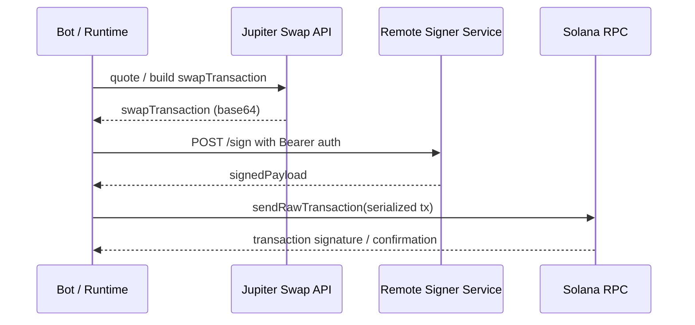

# Signing Architecture

Scope: evidence-backed description of how BobbyExecute obtains signing authority.
Authority: canonical support doc only. This file describes the current repo truth; it does not change runtime authority.

## 1. Objective

Explain why the root `.env` does not need a private-key variable and identify where signing authority actually comes from.

## 2. Current Truth

- The bot/runtime does not load a local Solana private key from the root `.env`.
- Live execution requires `SIGNER_MODE=remote`, `SIGNER_URL`, and `SIGNER_AUTH_TOKEN`.
- The bot/runtime keeps the public wallet identity in `WALLET_ADDRESS`.
- The actual private key lives in the separate `signer/` service as `SIGNER_WALLET_PRIVATE_KEY`.
- In `dry` and `paper` modes, the swap path can return without signing or network submission.
- The repo contains no browser-wallet adapter path for Phantom, Solflare, Backpack, or similar wallet extensions.
- The repo contains no code evidence for MPC, KMS, HSM, or a custodial wallet provider.

## 3. Signing Flow

## 4. Bot-Side Authority Path

1. `bot/src/config/config-schema.ts` parses `SIGNER_MODE`, `SIGNER_URL`, `SIGNER_AUTH_TOKEN`, and `WALLET_ADDRESS`.
2. `bot/src/config/safety.ts` fails closed if live trading is enabled without a remote signer.
3. `bot/src/runtime/create-runtime.ts` refuses live boot unless signer mode is remote.
4. `bot/src/runtime/live-runtime.ts` constructs the signer from config and injects it into execution.
5. `bot/src/adapters/dex-execution/swap.ts` builds or fetches a serialized swap transaction.
6. The same module sends the serialized transaction to `deps.signer.sign(...)`.
7. The bot then serializes the signed transaction and submits it through `rpcClient.sendRawTransaction(...)`.

## 5. Signer-Service Authority Path

1. `signer/src/config.ts` loads `SIGNER_WALLET_PRIVATE_KEY`, `SIGNER_WALLET_ADDRESS`, and `SIGNER_AUTH_TOKEN`.
2. `signer/src/config.ts` derives a `Keypair` from the private key and verifies that the public address matches.
3. `signer/src/backend.ts` accepts only serialized transactions in base64 form.
4. `signer/src/backend.ts` verifies the transaction payer matches the configured wallet address.
5. `signer/src/backend.ts` signs the transaction with the local keypair and returns the signed payload.
6. `signer/src/server.ts` exposes `POST /sign` behind Bearer-token authentication.

## 6. Env Reality

### Bot / runtime envs

- `WALLET_ADDRESS`
- `SIGNER_MODE`
- `SIGNER_URL`
- `SIGNER_AUTH_TOKEN`
- `SIGNER_KEY_ID`
- `SIGNER_TIMEOUT_MS`

### Signer-service envs

- `SIGNER_AUTH_TOKEN`
- `SIGNER_WALLET_PRIVATE_KEY`
- `SIGNER_WALLET_ADDRESS`
- `SIGNER_KEY_ID`
- `SIGNER_PORT`
- `SIGNER_HOST`

### Non-signing envs that still matter

- `RPC_MODE`
- `RPC_URL`
- `JUPITER_API_KEY`
- `CONTROL_TOKEN`
- `OPERATOR_READ_TOKEN`

### Variables that are intentionally absent from the root `.env`

- `PRIVATE_KEY`
- `SECRET_KEY`
- `SOLANA_PRIVATE_KEY`
- `SOLANA_SECRET_KEY`
- `KEYPAIR`
- `MNEMONIC`
- `SEED`

## 7. Reality / Inference / Unknown

### Reality

- The bot/runtime uses a remote signer boundary.
- The signer service is the only repo code that loads a raw Solana private key.
- Dry-run and paper-mode flows can prepare or simulate execution without signing.

### Inference

- Live execution is intentionally designed to keep raw signing material out of the bot/runtime process.
- The signer service is the operational custody boundary for the keypair in this repository.

### Unknown

- The exact production host for the signer service is not proven by `render.yaml`.
- Whether the signer is hosted on Render, another platform, or only locally available is not fully verifiable from this repo.
- No code evidence was found for browser-wallet delegation, MPC, or HSM/KMS-backed signing in this repository.

## 8. Why No Private-Key Variable in the Root `.env`?

Because the root `.env` belongs to the bot/runtime process, not to the signing service.

The bot/runtime only needs:

- the public wallet address,
- the remote signer endpoint,
- the remote signer auth token.

The private key is intentionally isolated in the separate `signer/` service and is not required by the bot/runtime process. In `dry` and `paper` modes, even that separate signer is not exercised because the swap flow returns before signing.

## 9. Risk Notes

- Security risk: the signer is a hard trust boundary and must remain isolated.
- Operational risk: live trading fails closed if the signer cannot be reached or authenticated.
- Documentation risk: the split between bot env and signer env is easy to miss if you only inspect the root `.env`.
- Deployment ambiguity: the repo shows the signer protocol and local service, but not a complete production deployment declaration for the signer.

