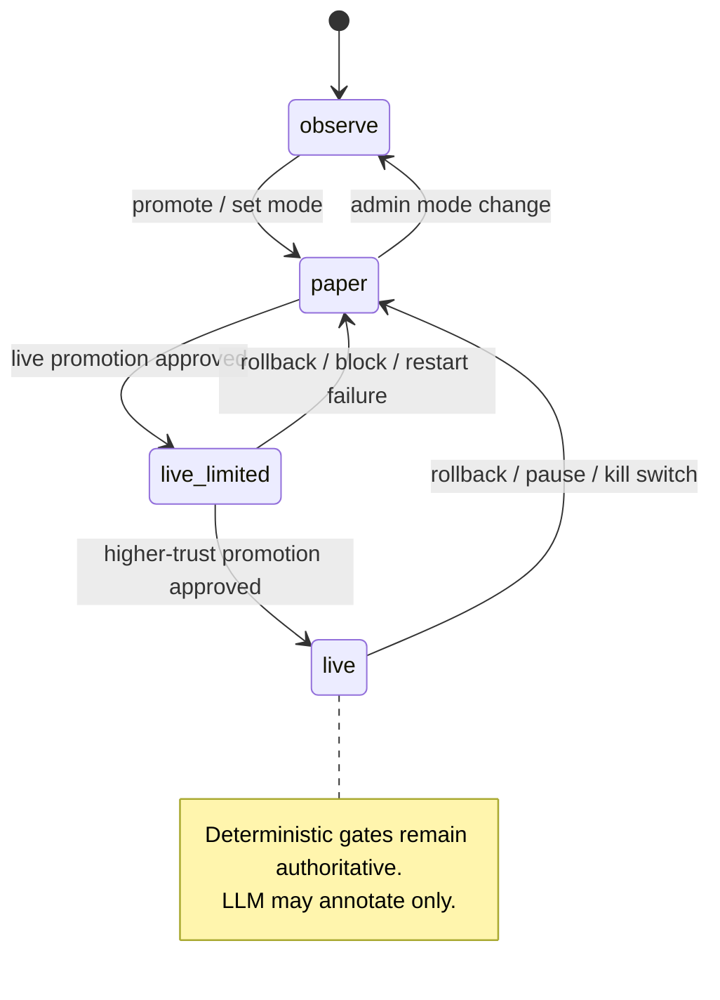

# BobbyExecution Control Plane Completion Audit

## 1. Executive Summary

- [Confirmed] The dashboard and control plane are real, not a mock shell. The public bot service, dashboard proxy, operator auth, live promotion workflow, restart orchestration, runtime config manager, and control-governance repositories are all present in code. Key entry points include [bot/src/server/index.ts](C:/workspace/main_projects/dotBot/bobbyExecute/bot/src/server/index.ts), [bot/src/server/routes/control.ts](C:/workspace/main_projects/dotBot/bobbyExecute/bot/src/server/routes/control.ts), [dashboard/src/app/api/control/[...path]/route.ts](C:/workspace/main_projects/dotBot/bobbyExecute/dashboard/src/app/api/control/[...path]/route.ts), and [dashboard/src/lib/operator-auth.ts](C:/workspace/main_projects/dotBot/bobbyExecute/dashboard/src/lib/operator-auth.ts).
- [Confirmed] The control plane is fail-closed by default. Privileged actions require a control token on the bot side, a signed dashboard operator assertion, and role checks. Direct `live` / `live_limited` mode changes are blocked and must go through live promotion governance.
- [Confirmed] The strongest gaps are truthfulness and operator ergonomics, not the absence of core control primitives. The `Risk Score`, `Chaos Pass Rate`, and `P95 Latency` surfaces are either defaulted, unhooked, or only partially sourced. The Decisions page is a derived action-log projection, not a canonical decision journal.
- [Confirmed] The current UI can create false confidence if operators assume every headline metric is a live business metric. `Data Quality` is a circuit-breaker / adapter-health ratio, not a semantic quality score. `Risk Score` defaults to `0` and `Chaos Pass Rate` defaults to `1` unless injected into the server constructor. No in-repo call sites were found for `recordLatency`, so latency buckets appear effectively empty unless some external path records them.
- [Proposed] The next completion step should be: make the UI operationally honest first, then add richer incident-grade filters, then add provider-neutral LLM advisory analysis as read-only evidence amplification only.

## 2. Screen Inventory

### Dashboard

| Status | What the UI shows | What feeds it | Truthfulness | Missing operator-grade functionality |
|---|---|---|---|---|
| [Confirmed] | Global `LIVE` badge, health state, bot runtime state, uptime, stale badge, last decision time. | `useHealth()` and `useSummary()` in [dashboard/src/components/layout/topbar.tsx](C:/workspace/main_projects/dotBot/bobbyExecute/dashboard/src/components/layout/topbar.tsx), backed by `/health` and `/kpi/summary` in [dashboard/src/lib/api.ts](C:/workspace/main_projects/dotBot/bobbyExecute/dashboard/src/lib/api.ts). | [Confirmed] Real, but some fields are derived from runtime visibility and may reflect stale or fallback state. | [Proposed] Show source labels for each status bit and expose the exact blocker / reason strings that produced `DEGRADED` or `FAIL`. |
| [Confirmed] | KPI cards: System Health, Risk Score, Chaos Pass Rate, Data Quality. | `HeroCards` consumes `summary` and `health` from `/kpi/summary` and `/health` in [dashboard/src/components/dashboard/hero-cards.tsx](C:/workspace/main_projects/dotBot/bobbyExecute/dashboard/src/components/dashboard/hero-cards.tsx). | [Confirmed] `Risk Score` and `Chaos Pass Rate` are defaulted in the server route unless injected. `Data Quality` is a health ratio, not a business-quality score. | [Proposed] Explicitly label the source and derivation of each card. Hide or mark any card whose producer is not wired. |
| [Confirmed] | Trades Today and P95 Latency. | `ActivitySection` reads `/kpi/summary` and `/kpi/metrics` in [dashboard/src/components/dashboard/activity-section.tsx](C:/workspace/main_projects/dotBot/bobbyExecute/dashboard/src/components/dashboard/activity-section.tsx). | [Confirmed] Trades Today is derived from action-log entries. `P95 Latency` is empty unless a metric recorder writes to the in-memory histogram. | [Proposed] Show "no recorded latency yet" and the source name for each latency series. |
| [Confirmed] | Adapter Health table and recent decisions timeline. | `AdapterHealthTable` and `DecisionTimeline` on [dashboard/src/app/page.tsx](C:/workspace/main_projects/dotBot/bobbyExecute/dashboard/src/app/page.tsx). | [Confirmed] Adapter health is real, but the current API can fall back to circuit-breaker state, runtime adapter health, or hardcoded down adapters. Decisions are derived from action logs, not the canonical engine decision authority. | [Proposed] Add provenance badges: `circuit breaker`, `runtime snapshot`, `fallback`, `action-log derived`. |

### Adapters

| Status | What the UI shows | What feeds it | Truthfulness | Missing operator-grade functionality |
|---|---|---|---|---|
| [Confirmed] | Searchable adapter list with healthy / degraded / down states, latency, last success, consecutive failures, and a detail panel. | `/kpi/adapters` via `useAdapters()` in [dashboard/src/app/adapters/page.tsx](C:/workspace/main_projects/dotBot/bobbyExecute/dashboard/src/app/adapters/page.tsx) and [dashboard/src/hooks/use-adapters.ts](C:/workspace/main_projects/dotBot/bobbyExecute/dashboard/src/hooks/use-adapters.ts). | [Confirmed] Real, but latency is a circuit-breaker average and can be `0` when derived from runtime fallback state. | [Proposed] Add freshness age, evidence source, and business criticality per adapter. |
| [Confirmed] | Live list of adapter IDs is limited to what the bot route returns. | `/kpi/adapters` in [bot/src/server/routes/kpi.ts](C:/workspace/main_projects/dotBot/bobbyExecute/bot/src/server/routes/kpi.ts). | [Confirmed] It is backed by the circuit breaker when available; otherwise it falls back to runtime adapter health or hardcoded down adapters. | [Proposed] Distinguish provider outages from data-staleness and fallback-only visibility. |

### Decisions

| Status | What the UI shows | What feeds it | Truthfulness | Missing operator-grade functionality |
|---|---|---|---|---|
| [Confirmed] | Total decisions, Allow / Block / Abort counts, token search, min confidence filter, selected decision detail. | `/kpi/decisions` via `useDecisions()` in [dashboard/src/app/decisions/page.tsx](C:/workspace/main_projects/dotBot/bobbyExecute/dashboard/src/app/decisions/page.tsx) and [dashboard/src/hooks/use-decisions.ts](C:/workspace/main_projects/dotBot/bobbyExecute/dashboard/src/hooks/use-decisions.ts). | [Confirmed] The page is a derived projection of `ActionLogEntry` records from [bot/src/observability/action-log.ts](C:/workspace/main_projects/dotBot/bobbyExecute/bot/src/observability/action-log.ts), not a dedicated decision journal. | [Proposed] Add server-side filters, provenance, blockers, actor touch, mode-at-decision, and evidence pack drilldown. |
| [Confirmed] | Confidence chip and token display for each row. | `actionToKpiDecision()` in [bot/src/server/routes/kpi.ts](C:/workspace/main_projects/dotBot/bobbyExecute/bot/src/server/routes/kpi.ts). | [Confirmed] The action classification is heuristic: `blocked === true` => block, `skillBlockReason` => abort, otherwise allow. | [Proposed] Replace heuristic classification with explicit canonical decision fields from the engine journal. |

### Control

| Status | What the UI shows | What feeds it | Truthfulness | Missing operator-grade functionality |
|---|---|---|---|---|
| [Confirmed] | Operator Access login / session, sign out, role banner, admin capability note. | Dashboard auth endpoints and session cookie handling in [dashboard/src/app/api/auth/login/route.ts](C:/workspace/main_projects/dotBot/bobbyExecute/dashboard/src/app/api/auth/login/route.ts), [dashboard/src/app/api/auth/session/route.ts](C:/workspace/main_projects/dotBot/bobbyExecute/dashboard/src/app/api/auth/session/route.ts), and [dashboard/src/lib/operator-auth.ts](C:/workspace/main_projects/dotBot/bobbyExecute/dashboard/src/lib/operator-auth.ts). | [Confirmed] Real operator authentication with signed cookies and an env-backed operator directory. | [Proposed] Add session expiry display, role explanation, and last privileged action audit visibility. |
| [Confirmed] | Live Promotion Governance, gate state, current mode, runtime state, role required, target mode, request / approve / deny / apply / rollback. | `/control/live-promotion*` and `/control/status` from [bot/src/server/routes/control.ts](C:/workspace/main_projects/dotBot/bobbyExecute/bot/src/server/routes/control.ts) via [dashboard/src/app/control/page.tsx](C:/workspace/main_projects/dotBot/bobbyExecute/dashboard/src/app/control/page.tsx). | [Confirmed] Real workflow, but direct live transitions are not allowed; they must go through the promotion path. | [Proposed] Surface requested vs applied state, restart requirement, and blocker categories as first-class filters. |
| [Confirmed] | Rehearsal Freshness, Worker Restart State, Restart Alerts, Delivery Journal, Kill Switch Status, Emergency Stop, Reset Kill Switch. | `ControlStatusResponse`, restart repository, alert repository, and delivery journal endpoints in [bot/src/server/routes/control.ts](C:/workspace/main_projects/dotBot/bobbyExecute/bot/src/server/routes/control.ts) and [dashboard/src/lib/delivery-drilldown.ts](C:/workspace/main_projects/dotBot/bobbyExecute/dashboard/src/lib/delivery-drilldown.ts). | [Confirmed] Real, and more complete than the screenshots suggest. | [Proposed] Add control-state filters, action history, and blocker reason breakdowns. |

## 3. Wiring Map

| Surface | Frontend component / hook | API route | Service / route logic | Domain logic | Storage / adapter source | Status |
|---|---|---|---|---|---|---|
| Dashboard health badge | `Topbar` -> `useHealth()` | `GET /health` | [bot/src/server/routes/health.ts](C:/workspace/main_projects/dotBot/bobbyExecute/bot/src/server/routes/health.ts) | `checkHealth()` in [bot/src/observability/health.ts](C:/workspace/main_projects/dotBot/bobbyExecute/bot/src/observability/health.ts) | `circuitBreaker`, `runtimeVisibilityRepository`, live runtime snapshot | [Confirmed] |
| KPI summary cards | `HeroCards` -> `useSummary()` | `GET /kpi/summary` | [bot/src/server/routes/kpi.ts](C:/workspace/main_projects/dotBot/bobbyExecute/bot/src/server/routes/kpi.ts) | `loadVisibleRuntimeState()`, `ActionLogger`, runtime visibility | `ActionLogger`, `runtime_visibility_snapshots`, circuit breaker, defaults for `riskScore` / `chaosPassRate` | [Confirmed] |
| Latency card | `ActivitySection` -> `useMetrics()` | `GET /kpi/metrics` | [bot/src/server/routes/kpi.ts](C:/workspace/main_projects/dotBot/bobbyExecute/bot/src/server/routes/kpi.ts) | `getP95()` from [bot/src/observability/metrics.ts](C:/workspace/main_projects/dotBot/bobbyExecute/bot/src/observability/metrics.ts) | In-memory histogram only unless an external writer records values | [Confirmed] |
| Adapter list | `AdaptersPage` -> `useAdapters()` | `GET /kpi/adapters` | [bot/src/server/routes/kpi.ts](C:/workspace/main_projects/dotBot/bobbyExecute/bot/src/server/routes/kpi.ts) | circuit breaker health mapping + runtime fallback | `CircuitBreaker`, runtime adapter health, hardcoded `ADAPTER_IDS` fallback | [Confirmed] |
| Decision list | `DecisionsPage` -> `useDecisions()` | `GET /kpi/decisions` | [bot/src/server/routes/kpi.ts](C:/workspace/main_projects/dotBot/bobbyExecute/bot/src/server/routes/kpi.ts) | `actionToKpiDecision()` heuristic over `ActionLogEntry` | `ActionLogger` JSONL / in-memory cache | [Confirmed] |
| Operator session | `useOperatorSession()`, login / logout forms | `POST /api/auth/login`, `GET /api/auth/session`, `POST /api/auth/logout` | [dashboard/src/app/api/auth/*](C:/workspace/main_projects/dotBot/bobbyExecute/dashboard/src/app/api/auth) | signed cookie session envelope + env-backed operator directory | dashboard cookie secret + operator directory env | [Confirmed] |
| Privileged control proxy | `useControlStatus()` and all control mutations | `POST /api/control/*` proxy | [dashboard/src/app/api/control/[...path]/route.ts](C:/workspace/main_projects/dotBot/bobbyExecute/dashboard/src/app/api/control/[...path]/route.ts) | signed operator assertion and role check before forwarding | `CONTROL_TOKEN`, dashboard session cookie, control service URL | [Confirmed] |
| Runtime status | `useControlStatus()` | `GET /api/control/status` -> `GET /control/status` | [bot/src/server/routes/control.ts](C:/workspace/main_projects/dotBot/bobbyExecute/bot/src/server/routes/control.ts) | `RuntimeConfigManager`, `loadVisibleRuntimeState()`, rehearsal gate, live control snapshot | runtime config repo, visibility repo, governance repo | [Confirmed] |
| Live promotion | Control page request / approve / deny / apply / rollback | `POST /api/control/live-promotion/*` -> `/control/live-promotion/*` | [bot/src/server/routes/control.ts](C:/workspace/main_projects/dotBot/bobbyExecute/bot/src/server/routes/control.ts) | `evaluateLivePromotionGateWithRehearsalEvidence()`, `RuntimeConfigManager.setMode()` | governance repo + runtime config repo | [Confirmed] |
| Restart worker | Control page restart button | `POST /api/control/restart-worker` -> `/control/restart-worker` | [bot/src/server/routes/control.ts](C:/workspace/main_projects/dotBot/bobbyExecute/bot/src/server/routes/control.ts) | `WorkerRestartService.requestRestart()` | restart repo, alert repo, orchestrator, runtime visibility | [Confirmed] |
| Restart alerts / delivery journal | Control page alerts + journal tabs | `GET /api/control/restart-alerts`, `GET /api/control/restart-alert-deliveries*` -> bot control routes | [bot/src/server/routes/control.ts](C:/workspace/main_projects/dotBot/bobbyExecute/bot/src/server/routes/control.ts) | alert aggregation + delivery journal filters | restart alert repository and event journal | [Confirmed] |

## 4. Adapter Topology

| Adapter | Files | Role | Criticality | Freshness signal | Health signal | Fail mode | Consumers | Dashboard visibility | Control-plane relevance |
|---|---|---|---|---|---|---|---|---|---|
| [Confirmed] DexPaprika | [bot/src/adapters/dexpaprika/client.ts](C:/workspace/main_projects/dotBot/bobbyExecute/bot/src/adapters/dexpaprika/client.ts), [bot/src/adapters/adapters-with-cb.ts](C:/workspace/main_projects/dotBot/bobbyExecute/bot/src/adapters/adapters-with-cb.ts), [bot/src/adapters/provider-roles.ts](C:/workspace/main_projects/dotBot/bobbyExecute/bot/src/adapters/provider-roles.ts) | Primary market / pricing / pools | High | `validateFreshness()` on token / pool payloads | circuit breaker + freshness age | throw / breaker-open / stale skip | ingest, scoring, risk, adapter health | Yes | Indirect, via runtime health and data-quality |
| [Confirmed] Moralis | [bot/src/adapters/moralis/client.ts](C:/workspace/main_projects/dotBot/bobbyExecute/bot/src/adapters/moralis/client.ts), [bot/src/adapters/adapters-with-cb.ts](C:/workspace/main_projects/dotBot/bobbyExecute/bot/src/adapters/adapters-with-cb.ts) | Wallet / portfolio / holder data | High | `validateFreshness()` on wallet payloads | circuit breaker | throw / breaker-open / stale skip | wallet snapshot, holder-quality signals, adapter health | Yes | Indirect, via runtime health and evidence packs |
| [Confirmed] DexScreener | [bot/src/adapters/dexscreener/client.ts](C:/workspace/main_projects/dotBot/bobbyExecute/bot/src/adapters/dexscreener/client.ts), [bot/src/adapters/adapters-with-cb.ts](C:/workspace/main_projects/dotBot/bobbyExecute/bot/src/adapters/adapters-with-cb.ts) | Secondary token / pair intelligence | Medium | `validateFreshness()` on pair payloads | circuit breaker | throw / breaker-open / stale skip | research / fallback / comparison | Sometimes | Low, mostly intelligence and comparison |
| [Confirmed] Jupiter quote | [bot/src/adapters/dex-execution/quotes.ts](C:/workspace/main_projects/dotBot/bobbyExecute/bot/src/adapters/dex-execution/quotes.ts), [bot/src/adapters/dex-execution/jupiter-auth.ts](C:/workspace/main_projects/dotBot/bobbyExecute/bot/src/adapters/dex-execution/jupiter-auth.ts) | Live swap route quote | High | `fetchedAt` in quote result | HTTP resilience, auth key presence | quote failure / stale quote / invalid payload | live execution path | Not directly | High for live execution |
| [Confirmed] Jupiter swap | [bot/src/adapters/dex-execution/swap.ts](C:/workspace/main_projects/dotBot/bobbyExecute/bot/src/adapters/dex-execution/swap.ts) | Live swap build / sign / send pipeline | High | quote age check | signer + RPC + send / verify outcomes | fail-closed with stage-specific failure codes | live execution path | Not directly | High for live execution |
| [Confirmed] Solana RPC | [bot/src/adapters/rpc-verify/client.ts](C:/workspace/main_projects/dotBot/bobbyExecute/bot/src/adapters/rpc-verify/client.ts), [bot/src/adapters/rpc-verify/solana-web3-client.ts](C:/workspace/main_projects/dotBot/bobbyExecute/bot/src/adapters/rpc-verify/solana-web3-client.ts), [bot/src/adapters/rpc-verify/verify.ts](C:/workspace/main_projects/dotBot/bobbyExecute/bot/src/adapters/rpc-verify/verify.ts) | Truth layer for token, balance, receipt checks | High | RPC response freshness is implicit | receipt / balance / token info errors | stub or real RPC, failover to secondary URL | verify-before-trade / verify-after-trade | Not directly | High for live execution and verification |
| [Confirmed] Remote signer | [bot/src/adapters/signer/remote-signer.ts](C:/workspace/main_projects/dotBot/bobbyExecute/bot/src/adapters/signer/remote-signer.ts), [bot/src/adapters/signer/index.ts](C:/workspace/main_projects/dotBot/bobbyExecute/bot/src/adapters/signer/index.ts) | Signing boundary for live transactions | High | signer request / response validation timing | auth / timeout / response validation | disabled / unavailable / auth failed / bad response | live swap path only | Not directly | High for live execution safety |
| [Confirmed] Stub RPC | [bot/src/adapters/rpc-verify/client.ts](C:/workspace/main_projects/dotBot/bobbyExecute/bot/src/adapters/rpc-verify/client.ts) | Non-live test stub | Low | none | deterministic stub responses | fake confirmed / fixed balances | tests and paper paths | No | Low |
| [Confirmed] Fallback cache wrapper | [bot/src/adapters/adapters-with-cb.ts](C:/workspace/main_projects/dotBot/bobbyExecute/bot/src/adapters/adapters-with-cb.ts), [bot/src/adapters/fallback-cache.ts](C:/workspace/main_projects/dotBot/bobbyExecute/bot/src/adapters/fallback-cache.ts) | TTL cache around provider failures | Medium | cache timestamp | cache hit / miss | stale-but-served fallback | wrapped providers | Indirect | Medium, because it can mask transient provider failure |
| [Confirmed] Circuit breaker wrapper | [bot/src/adapters/adapters-with-cb.ts](C:/workspace/main_projects/dotBot/bobbyExecute/bot/src/adapters/adapters-with-cb.ts), [bot/src/governance/circuit-breaker.ts](C:/workspace/main_projects/dotBot/bobbyExecute/bot/src/governance/circuit-breaker.ts) | Fail-closed health gate | High | breaker last-checked timestamp | healthy / degraded / open | blocks unhealthy adapters | health, adapter selection, orchestration | Yes | High |
| [Confirmed] FileSystemActionLogger / InMemoryActionLogger | [bot/src/observability/action-log.ts](C:/workspace/main_projects/dotBot/bobbyExecute/bot/src/observability/action-log.ts) | Derived decision feed | High | JSONL timestamp | append success | unavailable unless wired | decisions timeline, KPI summary | Yes, indirectly | High for decision surface |
| [Confirmed] FileSystemJournalWriter / InMemoryJournalWriter | [bot/src/journal-writer/writer.ts](C:/workspace/main_projects/dotBot/bobbyExecute/bot/src/journal-writer/writer.ts) | Canonical append-only journal | High | entry timestamps | append success | fail-closed on write failure | engine, audit trail | Not directly today | High |
| [Confirmed] RuntimeConfigRepository | [bot/src/persistence/runtime-config-repository.ts](C:/workspace/main_projects/dotBot/bobbyExecute/bot/src/persistence/runtime-config-repository.ts) | Requested / applied runtime config truth | High | version timestamps | schema / active row consistency | persistence failure | control status, mode changes, rollback | Yes, via control page | High |
| [Confirmed] ControlGovernanceRepository | [bot/src/persistence/control-governance-repository.ts](C:/workspace/main_projects/dotBot/bobbyExecute/bot/src/persistence/control-governance-repository.ts) | Audit, live promotion, rehearsal evidence, freshness alerts | High | evidence / request timestamps | audit / alert / promotion state | missing repo => 503 on control paths | control page and gates | Yes, partially | High |
| [Confirmed] WorkerRestartRepository / AlertRepository | [bot/src/persistence/worker-restart-repository.ts](C:/workspace/main_projects/dotBot/bobbyExecute/bot/src/persistence/worker-restart-repository.ts), [bot/src/persistence/worker-restart-alert-repository.ts](C:/workspace/main_projects/dotBot/bobbyExecute/bot/src/persistence/worker-restart-alert-repository.ts) | Restart request truth, alerts, and delivery journal | High | request / alert timestamps | convergence, alert status, delivery health | unconfigured / rejected / cooldown / failed | control page, restart service | Yes | High |

## 5. Current Control Model

### Read / Write Surfaces

| Action | Endpoint | Role | Behavior | Requested vs applied | Audit | Status |
|---|---|---|---|---|---|---|
| [Confirmed] Session login | `POST /api/auth/login` | none yet | Issues a signed dashboard cookie from env-backed operator directory. | N/A | no control audit yet | Working |
| [Confirmed] Session read / logout | `GET /api/auth/session`, `POST /api/auth/logout` | none | Reads or clears cookie. | N/A | no control audit yet | Working |
| [Confirmed] Read control status | `GET /api/control/status` -> `GET /control/status` | session not required to read, but proxy path uses token | Returns runtime config, worker, restart, restart alerts, kill switch, live control, rehearsal status. | Exposes requested, applied, pending, requiresRestart, reloadNonce, killSwitch. | Read-only | Working |
| [Confirmed] Mode change | `POST /control/mode` | operator / admin proxy to bot-side role check | Direct `live` / `live_limited` requests are rejected with 409 and forced into live promotion workflow. Non-live modes can be changed. | `RuntimeConfigManager.setMode()` updates requested state; applied state may lag when restart is required. | yes, via control audit | Working |
| [Confirmed] Runtime config patch | `POST /control/runtime-config` | operator / admin depending on patch type | Applies behavior patch, may set `pendingApply` and `requiresRestart`. | Explicit requested/applied split in `RuntimeConfigManager`. | yes | Working |
| [Confirmed] Reload | `POST /control/reload` | operator / admin | Bumps reload nonce, may leave pending apply state. | `reloadNonce` tracked in active/requested state. | yes | Working |
| [Confirmed] Pause / resume | `POST /control/pause`, `POST /control/resume` | operator or admin depending on action | Toggles runtime overlay pause state. | Can be queued during cycle boundaries. | yes | Working |
| [Confirmed] Kill switch / emergency stop | `POST /control/emergency-stop` or `/control/halt` -> proxy maps to kill switch path | admin | Activates kill switch, halts runtime, forces degraded / blocked posture. | Overlay state changes; control view reflects active kill switch. | yes | Working |
| [Confirmed] Reset kill switch | `POST /control/reset` | admin | Clears kill switch, runtime remains disarmed until re-armed. | Overlay and live-control snapshot update. | yes | Working |
| [Confirmed] Restart worker | `POST /control/restart-worker` | admin | Requests restart only when required / allowed by restart service. | Restart request record tracks requested / dispatched / converged / failed / rejected / cooldown / unconfigured. | yes | Working |
| [Confirmed] Live promotion request / approve / deny / apply / rollback | `POST /control/live-promotion/*` | admin | Live promotion uses a gate plus a workflow record. Apply / rollback call `runtimeConfigManager.setMode()`. | Request state and application state are separate. | yes | Working |
| [Confirmed] Restart alert acknowledge / resolve | `POST /control/restart-alerts/:id/*` | operator or admin | Changes alert status and records audit. | Alert record updates with actor metadata. | yes | Working |

### State machine



- [Confirmed] Requested vs applied state is already real in `RuntimeConfigManager`. It keeps `requestedVersionId`, `appliedVersionId`, `pendingApply`, `requiresRestart`, and `reloadNonce` separate in [bot/src/runtime/runtime-config-manager.ts](C:/workspace/main_projects/dotBot/bobbyExecute/bot/src/runtime/runtime-config-manager.ts).
- [Confirmed] Live promotion and restart orchestration already have convergence semantics. Restart requests are reconciled against worker visibility and can transition to `converged`, `failed`, `rejected`, `cooldown`, or `unconfigured`.
- [Proposed] The control page should make requested / applied / pending / failed a first-class visual model, not a secondary detail panel.

## 6. Gaps and False Confidence Risks

| Status | Risk | Why it matters | Evidence |
|---|---|---|---|
| [Confirmed] | `Risk Score` can look live while actually being the default `0`. | Operators may assume a risk engine is feeding the card when the public bootstrap does not inject one. | [bot/src/server/routes/kpi.ts](C:/workspace/main_projects/dotBot/bobbyExecute/bot/src/server/routes/kpi.ts), [bot/src/bootstrap.ts](C:/workspace/main_projects/dotBot/bobbyExecute/bot/src/bootstrap.ts) |
| [Confirmed] | `Chaos Pass Rate` can look live while actually being the default `1`. | This makes the dashboard look better than the wiring proves. | [bot/src/server/routes/kpi.ts](C:/workspace/main_projects/dotBot/bobbyExecute/bot/src/server/routes/kpi.ts), [bot/src/bootstrap.ts](C:/workspace/main_projects/dotBot/bobbyExecute/bot/src/bootstrap.ts) |
| [Confirmed] | `P95 Latency` appears to exist but there are no in-repo record calls to populate it. | The card can read as an active telemetry stream when it is likely empty. | [bot/src/observability/metrics.ts](C:/workspace/main_projects/dotBot/bobbyExecute/bot/src/observability/metrics.ts) and repo-wide search findings |
| [Confirmed] | `Data Quality` is not a semantic data-quality score. | It is a healthy / total adapter ratio or circuit-breaker ratio. | [bot/src/server/routes/kpi.ts](C:/workspace/main_projects/dotBot/bobbyExecute/bot/src/server/routes/kpi.ts) |
| [Confirmed] | The Decisions page is derived from action logs, not the canonical engine journal. | Operators may mistake derived heuristics for authoritative decision truth. | [bot/src/server/routes/kpi.ts](C:/workspace/main_projects/dotBot/bobbyExecute/bot/src/server/routes/kpi.ts), [bot/src/observability/action-log.ts](C:/workspace/main_projects/dotBot/bobbyExecute/bot/src/observability/action-log.ts), [bot/src/core/decision/decision-coordinator.ts](C:/workspace/main_projects/dotBot/bobbyExecute/bot/src/core/decision/decision-coordinator.ts) |
| [Confirmed] | The current Decisions filters are too weak for incident triage. | Only action, token substring, and min confidence are available in the UI. | [dashboard/src/app/decisions/page.tsx](C:/workspace/main_projects/dotBot/bobbyExecute/dashboard/src/app/decisions/page.tsx) |
| [Confirmed] | The control page has real state, but the operator still has to infer what is blocked and why. | The backend surfaces rich reason codes, but the UI should promote them much more aggressively. | [bot/src/server/routes/control.ts](C:/workspace/main_projects/dotBot/bobbyExecute/bot/src/server/routes/control.ts), [bot/src/runtime/live-control.ts](C:/workspace/main_projects/dotBot/bobbyExecute/bot/src/runtime/live-control.ts) |
| [Confirmed] | No direct control UI exists for the operator audit log table. | The system records privileged actions, but the UI does not expose the audit stream as a first-class object. | [bot/src/persistence/control-governance-repository.ts](C:/workspace/main_projects/dotBot/bobbyExecute/bot/src/persistence/control-governance-repository.ts) |
| [Inferred] | The current dashboard can mislead a new operator into thinking every visible number is equally authoritative. | The UI mixes real, derived, fallback, and default values without strong provenance labels. | Derived from the wiring above |

## 7. Target Control Plane Concept

### Design goals

- [Confirmed] Preserve deterministic control as the source of truth.
- [Confirmed] Make the dashboard read-only by default and privilege-gated only through the existing operator session plus control-token proxy.
- [Confirmed] Treat LLMs as advisory only.
- [Proposed] Every control decision should be explainable from a sealed evidence pack with a stable hash and a visible status trail.

### Proposed surface split

| Surface | Audience | Mutability | Source of truth | Notes |
|---|---|---|---|---|
| [Proposed] Read-only operations | all users / viewers | none | health, KPI, decisions, adapter health | Provenance labels must be visible. |
| [Proposed] Privileged control | operator / admin | limited writes | runtime config manager, live promotion repo, restart repo | Mutations must be auditable and role-gated. |
| [Proposed] Incident review | operator / admin | annotations only | decision journal, control audit, alert history, evidence packs | No state changes to runtime. |
| [Proposed] LLM advisory | operator / admin | none | provider output cache and annotations | Cannot alter permissions, mode, or execution. |

### Safe state machine

- [Confirmed] Existing runtime modes already support `observe`, `paper`, `live_limited`, and `live` in [bot/src/config/runtime-config-schema.ts](C:/workspace/main_projects/dotBot/bobbyExecute/bot/src/config/runtime-config-schema.ts).
- [Proposed] The live-control model should present a single convergence ladder:
  - `requested`
  - `applied`
  - `pending_restart`
  - `failed`
  - `blocked`
  - `rolled_back`
- [Proposed] Operators should see a single blocker summary that merges:
  - runtime config drift
  - restart convergence failure
  - kill switch
  - rehearsal freshness failure
  - adapter degradation
  - live promotion gate rejection

### First-response workflow

1. [Proposed] Open the Control page.
2. [Proposed] Inspect the gate summary, requested/applied state, worker freshness, and live promotion blockers.
3. [Proposed] Review the latest privileged actions and restart alerts.
4. [Proposed] Open the decision list filtered to the incident token / time window.
5. [Proposed] Open the evidence pack for the blocked or aborted decisions.
6. [Proposed] If live promotion is blocked, resolve the blocker category first, not the mode button.

## 8. Decision Filter Redesign

### What should exist

| Filter | Recommended handling | Why |
|---|---|---|
| [Proposed] Outcome: allow / block / abort / review | Server-side indexed | Core triage dimension. |
| [Proposed] Token / symbol / mint | Server-side indexed | Primary search axis for incidents. |
| [Proposed] Score / confidence ranges | Server-side indexed | Lets operators isolate marginal decisions. |
| [Proposed] Decision timestamp / time window | Server-side indexed | Required for incident slices. |
| [Proposed] Runtime mode at decision time | Server-side indexed | Distinguish observe / paper / live. |
| [Proposed] Policy status | Server-side indexed | Triage policy failures separately from signal failures. |
| [Proposed] Chaos scenario | Server-side indexed | Critical for fault-injection incidents. |
| [Proposed] Block reason class | Server-side indexed | Most block incidents are reason-class driven. |
| [Proposed] Abort reason class | Server-side indexed | Separates safety aborts from policy blocks. |
| [Proposed] Adapter provenance / evidence source | Server-side indexed | Needed to trace disagreements and stale data. |
| [Proposed] Data freshness | Server-side indexed | Staleness is a first-class incident trigger. |
| [Proposed] Liquidity band | Server-side indexed | Useful for market-structure incidents. |
| [Proposed] Volume band | Server-side indexed | Useful for low-liquidity / wash-trade investigations. |
| [Proposed] Holder-quality band | Server-side indexed | Lets operators isolate suspicious holders. |
| [Proposed] Price divergence band | Server-side indexed | Critical for provider-disagreement triage. |
| [Proposed] Route / execution source | Server-side indexed | Distinguish router / signer / RPC failures. |
| [Proposed] Latency bucket | Server-side indexed | Useful for network degradation incidents. |
| [Proposed] Live vs paper / dry-run vs real | Server-side indexed | Prevents cross-mode contamination. |
| [Proposed] Human-reviewed only | Server-side indexed | Operator follow-up queue. |
| [Proposed] Operator-touched only | Server-side indexed | Distinguish manually handled incidents. |
| [Proposed] LLM-tagged anomaly only | Server-side indexed | Advisory only, but searchable. |
| [Proposed] Provider disagreement only | Server-side indexed | Traces divergence between sources. |

### Filter classes

- [Proposed] Server-side indexed filters should power the main query API and be backed by decision rows or a flattened incident index.
- [Proposed] Client-side convenience filters should be limited to local sort, column hiding, row expansion, and quick presets over an already narrowed result set.
- [Proposed] Preset incident views should include:
  - `freshness failure`
  - `adapter disagreement`
  - `chaos block`
  - `human review queue`
  - `operator-touched`
  - `LLM anomaly`
- [Proposed] Saved operator views should persist per operator and per role, not globally by default.

### Current mismatch

- [Confirmed] The current decisions UI only supports action, token substring, and minimum confidence in [dashboard/src/app/decisions/page.tsx](C:/workspace/main_projects/dotBot/bobbyExecute/dashboard/src/app/decisions/page.tsx).
- [Proposed] Replace this with a facet bar plus a query-builder drawer, and keep the simple filters only as shortcuts.

## 9. Control Filter / Status Redesign

### What should be filterable

| Filter / status | Recommended handling | Source today | Proposed UI treatment |
|---|---|---|---|
| [Proposed] Gate allowed / blocked | First-class status chip | live promotion gate | show blocker count and top blocker category |
| [Proposed] Current mode / target mode | First-class state diff | runtime config + live promotion request | show requested vs applied in one pill group |
| [Proposed] Requested vs applied | First-class state diff | runtime config manager | show a convergence timeline |
| [Proposed] Pending restart | First-class warning | worker restart service | pin near top of page |
| [Proposed] Worker running / stale / stopped / degraded | First-class status chip | runtime visibility | use the same vocabulary everywhere |
| [Proposed] Kill switch state | First-class danger banner | kill-switch bridge | make reset path explicit |
| [Proposed] Adapter-critical degradation | First-class blocker chip | health / runtime adapter summary | link to adapter rows |
| [Proposed] Last privileged action | Audit pill | control audit log | show actor, role, action, time |
| [Proposed] Action actor / role | Audit pill | operator assertion | make role boundaries visible |
| [Proposed] Blocker reason category | Filter facet | gate / restart / rehearsal | show as chips and as counts |
| [Proposed] Config drift | Filter facet | runtime config status | surface requested/applied differences |
| [Proposed] Runtime heartbeat freshness | Filter facet | runtime visibility | show age and stale threshold |
| [Proposed] Rollout posture | Filter facet | live control snapshot | show `paper_only`, `micro_live`, `staged_live_candidate`, `paused_or_rolled_back` |

### Proposed layout

- [Proposed] Top row: gate status, current mode, target mode, requested / applied diff, pending restart, kill switch.
- [Proposed] Middle row: worker freshness, adapter health, rehearsal freshness, last privileged action.
- [Proposed] Bottom row: live promotion queue, restart queue, audit trail, delivery journal, blocker reasons.

### Current mismatch

- [Confirmed] The current control page already has many of these data sources, but they are split across sections rather than presented as a control-state model.
- [Proposed] The page should behave like a control console, not a collection of collapsible forms.

## 10. LLM Advisory Layer (OpenAI + xAI)

### Contract

| Rule | Requirement |
|---|---|
| [Confirmed] | LLM outputs must never mutate runtime mode, approvals, restart state, or execution permissions. |
| [Proposed] | OpenAI and xAI must share the same provider-neutral interface. |
| [Proposed] | The input must be a deterministic evidence pack. |
| [Proposed] | The output must be advisory annotations only. |
| [Proposed] | Prompts, summaries, labels, confidence, provider, model, error, and cache key must be audited. |
| [Proposed] | Timeouts, token budgets, and cost budgets must be strict. |
| [Proposed] | Cached and deduplicated results should be reused when the evidence pack hash matches. |
| [Proposed] | Provider disagreement must be explicit and searchable. |

### Safe evidence pack

- [Proposed] Allowed inputs:
  - sealed decision envelope
  - decision / control audit events
  - adapter health summary
  - freshness / blocker reasons
  - runtime mode and rollout posture
  - evidence hashes
  - public token / mint / pair references
- [Proposed] Redacted inputs:
  - secrets
  - operator passwords
  - raw auth tokens
  - private keys
  - raw session cookies
  - nonessential PII

### Advisory capabilities only

- [Proposed] concise decision explanation
- [Proposed] incident summary
- [Proposed] anomaly tagging
- [Proposed] cluster similar blocks / aborts
- [Proposed] suggest filter tags
- [Proposed] summarize why a gate is blocked
- [Proposed] highlight missing evidence
- [Proposed] compare OpenAI vs xAI interpretations

### Triggering model

- [Proposed] Trigger on:
  - operator-opened decision detail
  - blocked live promotion
  - restart alert escalation
  - provider disagreement
  - repeated block / abort clusters
  - explicit "summarize incident" action
- [Proposed] Do not trigger on every row by default; use on-demand and incident-bound batching.

### UI treatment

- [Proposed] Show provider output as a side panel on decision detail and control detail views.
- [Proposed] Show disagreement as a yellow / red badge with both interpretations side by side.
- [Proposed] Allow filtering by LLM tags, but never by any LLM recommendation as an authority.
- [Proposed] Surface errors and timeouts as advisory degradation, not as control failures.

### Proposed interface

```ts
interface AdvisoryProvider {
  analyze(input: EvidencePack): Promise<{
    provider: "openai" | "xai";
    model: string;
    summary: string;
    labels: string[];
    confidence: number;
    cacheKey: string;
    error?: string;
  }>;
}
```

## 11. Proposed Data Model Changes

| Table / entity | Purpose | Notes |
|---|---|---|
| [Proposed] `decision_journal` | Canonical decision rows | Replace the action-log projection as the primary decision feed. |
| [Proposed] `decision_evidence` | Evidence pack rows and hashes | Store provider inputs and source hashes. |
| [Proposed] `decision_tags` | LLM and operator tags | Supports anomaly / cluster / incident tagging. |
| [Proposed] `decision_block_reasons` | Normalized reason classes | Enables server-side indexed filtering. |
| [Proposed] `operator_action_audit` | Privileged action history | Could mirror / extend `control_operator_audit_log`. |
| [Proposed] `adapter_provenance_events` | Adapter payload / freshness provenance | Needed for trust and disagreement analysis. |
| [Proposed] `llm_analysis_runs` | Provider run log | Prompt hash, provider, model, latency, cost, status. |
| [Proposed] `llm_analysis_labels` | Advisory tags | Store labels, confidence, and source provider. |
| [Proposed] `llm_provider_disagreement` | Divergence tracking | Store side-by-side outputs and normalized diffs. |
| [Proposed] `saved_operator_views` | Persisted filters / presets | Per-user saved incident views. |
| [Proposed] `incident_presets` | Shared triage views | Admin-managed or team-managed defaults. |

### Existing tables that already matter

- [Confirmed] `runtime_config_versions`, `runtime_config_active`, and `config_change_log` in [bot/src/persistence/runtime-config-repository.ts](C:/workspace/main_projects/dotBot/bobbyExecute/bot/src/persistence/runtime-config-repository.ts).
- [Confirmed] `control_operator_audit_log`, `control_live_promotions`, `control_database_rehearsal_evidence`, and freshness alert tables in [bot/src/persistence/control-governance-repository.ts](C:/workspace/main_projects/dotBot/bobbyExecute/bot/src/persistence/control-governance-repository.ts).
- [Confirmed] `worker_restart_requests` in [bot/src/persistence/worker-restart-repository.ts](C:/workspace/main_projects/dotBot/bobbyExecute/bot/src/persistence/worker-restart-repository.ts).
- [Confirmed] Restart alert rows, events, and delivery journal rows in [bot/src/persistence/worker-restart-alert-repository.ts](C:/workspace/main_projects/dotBot/bobbyExecute/bot/src/persistence/worker-restart-alert-repository.ts).
- [Confirmed] `runtime_visibility_snapshots` in [bot/src/persistence/runtime-visibility-repository.ts](C:/workspace/main_projects/dotBot/bobbyExecute/bot/src/persistence/runtime-visibility-repository.ts).

## 12. Recommended Implementation Plan

| Phase | Why it matters | Likely files | Migration risk | Rollback plan | Tests |
|---|---|---|---|---|---|
| [Proposed] P0: audit fixes / truthfulness fixes | Prevent operator confusion now. | [dashboard/src/components/dashboard/hero-cards.tsx](C:/workspace/main_projects/dotBot/bobbyExecute/dashboard/src/components/dashboard/hero-cards.tsx), [dashboard/src/components/dashboard/activity-section.tsx](C:/workspace/main_projects/dotBot/bobbyExecute/dashboard/src/components/dashboard/activity-section.tsx), [dashboard/src/app/decisions/page.tsx](C:/workspace/main_projects/dotBot/bobbyExecute/dashboard/src/app/decisions/page.tsx) | Low | UI-only revert | contract tests for labels and fallback states |
| [Proposed] P1: adapter / source-of-truth completion | Make metrics and provenance real or explicitly absent. | [bot/src/observability/metrics.ts](C:/workspace/main_projects/dotBot/bobbyExecute/bot/src/observability/metrics.ts), execution path, adapter wrappers | Medium | keep old endpoints, gate new telemetry behind feature flag | metric recorder coverage, source-label tests |
| [Proposed] P2: operator-grade control visibility | Make control state understandable. | [dashboard/src/app/control/page.tsx](C:/workspace/main_projects/dotBot/bobbyExecute/dashboard/src/app/control/page.tsx), [bot/src/server/routes/control.ts](C:/workspace/main_projects/dotBot/bobbyExecute/bot/src/server/routes/control.ts) | Medium | preserve existing controls and add a backcompat view | control state snapshot tests, role tests, convergence tests |
| [Proposed] P3: decision filter redesign | Incident triage requires indexed facets. | [dashboard/src/app/decisions/page.tsx](C:/workspace/main_projects/dotBot/bobbyExecute/dashboard/src/app/decisions/page.tsx), new API / DB schema | Medium to high | keep current endpoint and add v2 beside it | query correctness, pagination, indexing tests |
| [Proposed] P4: LLM advisory layer | Add safe analysis without weakening control. | new advisory service, dashboard decision / control detail panels | Medium | feature flag off, no write paths | timeout / cost / redaction / disagreement tests |
| [Proposed] P5: saved incident views | Let operators reuse triage patterns. | new saved-view store, filter toolbar, presets | Low | delete feature flag and fall back to URL state | persistence, permission, export/import tests |

## 13. Test Plan

| Area | Required tests |
|---|---|
| [Confirmed] Auth and role boundaries | login / logout / session cookie tests; viewer vs operator vs admin control-action authorization; missing assertion denied; expired session denied. |
| [Confirmed] Control endpoint safety | direct `live` / `live_limited` changes rejected; runtime-config changes record audit; emergency stop and reset are admin-only; replay / idempotency behavior preserved. |
| [Confirmed] Requested vs applied convergence | requested mode differs from applied mode until the restart or apply step completes; `pendingApply` and `requiresRestart` are exposed correctly. |
| [Confirmed] Restart-required flows | restart request accepted / rejected / cooldown / unconfigured paths; convergence observed on worker visibility update; alert summary updates. |
| [Confirmed] Filter correctness | outcome, token, confidence, time-window, mode-at-decision, block class, and provenance filters return stable counts and stable pagination. |
| [Confirmed] Adapter health truthfulness | dashboard adapter rows match backend truth; degraded / stale / down states are explained by the underlying reason codes. |
| [Confirmed] Dashboard values matching backend truth | `/health`, `/kpi/summary`, `/kpi/adapters`, `/kpi/decisions`, `/kpi/metrics` contract tests against the UI expectations. |
| [Confirmed] LLM layer isolation | provider output cannot mutate runtime state; prompts are redacted; provider result cache is read-only. |
| [Confirmed] Provider timeout / failure | OpenAI / xAI timeouts, malformed responses, and auth failures surface as advisory errors only. |
| [Confirmed] Advisory disagreement surfacing | both provider interpretations are stored, compared, and searchable by disagreement flag. |

## 14. Final Recommendation

- [Confirmed] The control plane is already structurally real and fail-closed, which is the right foundation.
- [Confirmed] The largest remaining problem is operational honesty: several high-visibility KPIs are more derived or defaulted than the UI currently implies.
- [Confirmed] The Decisions page is too small to be an incident tool and must be rebuilt around indexed evidence and blockers.
- [Proposed] Fix truthfulness first, then expand triage filters, then add provider-neutral advisory analysis, and keep LLMs permanently outside the authority path.

## Minimal patch set to make the current UI operationally honest

- [Proposed] In [dashboard/src/components/dashboard/hero-cards.tsx](C:/workspace/main_projects/dotBot/bobbyExecute/dashboard/src/components/dashboard/hero-cards.tsx), label `Risk Score` and `Chaos Pass Rate` as `derived` / `unwired` unless a real producer is injected.
- [Proposed] In [dashboard/src/components/dashboard/activity-section.tsx](C:/workspace/main_projects/dotBot/bobbyExecute/dashboard/src/components/dashboard/activity-section.tsx), show `No recorded latency yet` and surface the metric source name.
- [Proposed] In [dashboard/src/app/decisions/page.tsx](C:/workspace/main_projects/dotBot/bobbyExecute/dashboard/src/app/decisions/page.tsx), add a visible note that the list is derived from action logs, not the canonical decision journal.
- [Proposed] In [dashboard/src/app/control/page.tsx](C:/workspace/main_projects/dotBot/bobbyExecute/dashboard/src/app/control/page.tsx), promote `requestedMode`, `appliedMode`, `pendingApply`, `requiresRestart`, `lastOperatorAction`, `reasonDetail`, and `databaseRehearsalStatus.statusMessage` to the top of the page.
- [Proposed] In [bot/src/server/routes/kpi.ts](C:/workspace/main_projects/dotBot/bobbyExecute/bot/src/server/routes/kpi.ts), stop returning default-looking `riskScore` / `chaosPassRate` values unless they are explicitly wired, or include a `source: default|wired` field.
